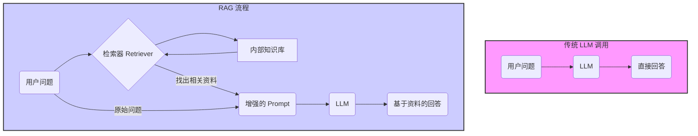

# LLM 与 RAG 核心概念解析

本文档旨在通过一个生动的比喻和清晰的定义，帮助您理解 **LLM (大语言模型)** 和 **RAG (检索增强生成)** 这两个核心概念。

---

### 喻言：一位聪明的学生

想象一下，有一位非常聪明、博览群书的学生，我们叫他 **“小言”**。

#### 1. LLM (大语言模型) 就是 “小言” 本人

*   **“小言” (LLM)** 经过多年的刻苦学习，阅读了互联网上几乎所有的公开书籍、文章和资料。他的大脑里装满了海量的知识，形成了一套强大的语言理解和生成能力。
*   **他的特点是**：
    *   **知识渊博**：你问他任何普遍性的问题（比如“什么是光合作用？”），他都能凭借记忆，滔滔不绝地给出一个非常流畅和全面的回答。
    *   **推理能力强**：他能理解复杂的指令，进行翻译、写诗、总结、写代码等创造性工作。
    *   **记忆有截止日期**：他的知识停留在他“毕业”的那一刻（比如 2023 年）。对于之后发生的新鲜事，他一无所知。
    *   **可能“一本正经地胡说八道”**：当被问及他知识范围之外或非常专业、私密的问题时，他可能会根据自己学到的语言模式，编造一个听起来非常合理但实际上是错误的答案（这被称为“幻觉”）。

> **一句话总结 LLM**：一个经过海量数据预训练、具备强大通用知识和语言能力的“超级大脑”。

#### 2. RAG (检索增强生成) 是给 “小言” 配备的“开卷考试工具”

现在，我们要让“小言”回答一些非常具体或私密的问题，比如：

*   “我们公司上个季度的财报数据怎么样？”
*   “根据最新的《员工手册 V3.5》，出差的报销流程是什么？”

这些问题，“小言”的通用知识库里肯定没有。直接问他，他要么说不知道，要么就会“幻觉”出一个答案。

这时，**RAG** 就派上用场了。RAG 不是改变“小言”的大脑，而是给了他一套**“开卷考试”**的流程和工具：

1.  **【检索 (Retrieval)】 - 查找资料**：
    *   当我们提出问题时，一个“图书管理员”（**Retriever/检索器**）会先介入。
    *   这个管理员会根据我们的问题，迅速地从公司的内部知识库（如财报、员工手册、产品文档）中，找出最相关的几页资料。

2.  **【增强 (Augmentation)】 - 整理笔记**：
    *   找到资料后，我们并不会让“小言”去读整个知识库。
    *   我们会把**原始问题**和**刚刚找到的相关资料**整理成一张“笔记”，然后递给“小言”。这张笔记就像这样：
        > “小言，请根据以下背景信息：‘【员工手册 V3.5 第 12 页】出差报销需先通过 OA 系统提交申请，审批通过后...’ 来回答这个问题：‘出差的报销流程是什么？’”

3.  **【生成 (Generation)】 - 开卷回答**：
    *   现在，“小言” (LLM) 拿到了这张包含明确上下文的“笔记”。
    *   他利用自己强大的语言理解和总结能力，阅读并消化这张笔记上的内容，然后给出一个精准、忠于原文的答案。他不再需要去“猜”或“编造”。

> **一句话总结 RAG**：一个让 LLM 在回答问题前，先从指定的知识库中查找相关资料，然后基于这些资料来生成答案的智能流程。

---

### 正式定义与对比

#### 流程对比图

#### 核心区别总结

| 特性 | LLM (大语言模型) | RAG (检索增强生成) |
| :--- | :--- | :--- |
| **本质** | 一个**组件**，一个强大的“大脑” | 一个**系统/流程**，一种使用大脑的方法 |
| **知识来源** | 预训练数据（公开、有截止日期） | 预训练数据 + **外部实时/私有知识库** |
| **解决问题** | 通用性、创造性的语言任务 | **知识幻觉**、**知识更新**、私有领域问答 |
| **成本** | 训练/微调成本极高 | 实现成本相对较低，主要是知识库的构建和维护 |
| **透明度** | 答案生成过程是“黑盒” | 答案**可溯源**，因为可以追溯到它参考了哪些文档 |

---

### 附录：什么是 Prompt (提示词)？

我们已经知道了 **LLM** 是聪明的学生“小言”，**RAG** 是给他配备的开卷考试工具。那么，**Prompt** 就是我们**向“小言”提出的问题或下达的指令**。

Prompt 的质量直接决定了“小言”回答的质量。这就像和真人沟通一样，你问得越清楚、越具体，得到的答案就越有价值。

#### Prompt 就是你对“小言”说的话

*   **简单的 Prompt**：
    *   “写一首关于月亮的诗。”
    *   “什么是量子力学？”
    *   这就像是随口问一个简单问题。小言会根据自己的理解自由发挥。

*   **精心设计的 Prompt (Prompt Engineering)**：
    *   这就像是给“小言”下达一个非常详尽、结构化的指令，以引导他给出我们期望的、高质量的回答。
    *   **示例**：
        > “请你扮演一位**角色**：浪漫主义诗人。你的**任务**是：写一首五言绝句，**主题**是月光下的思乡之情。请确保你的诗歌**风格**：语言优美，意境深远，并包含‘窗’和‘霜’这两个意象。请以**JSON格式**返回你的作品，包含‘title’和‘poem’两个字段。”

    *   这个精心设计的 Prompt 包含了：
        *   **角色 (Role)**：让他知道以什么身份来回答。
        *   **任务 (Task)**：明确他需要做什么。
        *   **上下文/约束 (Context/Constraints)**：提供了具体的创作要求和限制。
        *   **格式要求 (Format)**：指定了输出的形式。

    *   面对这样清晰的指令，“小言”就能更好地理解我们的意uto，给出一个远比简单提问更精准、更符合要求的答案。

> **一句话总结 Prompt**：它是用户与 LLM 沟通的媒介，是引导和控制 LLM 输出的指令。**Prompt Engineering (提示词工程)** 就是一门如何设计出高质量 Prompt 的艺术和科学。
