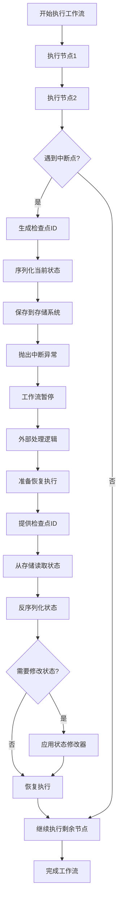

# Eino 中断与检查点机制 - 从入门到精通

## 🎯 什么是中断与检查点？

想象一下，你正在玩一个非常复杂的角色扮演游戏：

### 🎮 游戏存档的比喻

- **中断（Interrupt）** = 暂停游戏
  - 在BOSS战前暂停，准备策略
  - 在重要剧情选择前暂停，思考后果
  - 遇到难题时暂停，寻求帮助

- **检查点（Checkpoint）** = 游戏存档
  - 保存当前进度、装备、状态
  - 随时可以从存档点重新开始
  - 可以修改存档内容（比如增加血量）

在AI应用中也是如此！

### 🤖 AI工作流的实际场景

```
用户提问 → AI分析 → [暂停：需要人工审核] → 生成回答 → 返回用户
                     ↓
                 保存当前状态到检查点
                     ↓
             人工审核通过后从检查点恢复
```

**Eino 中断与检查点机制**就像是为AI工作流提供的"游戏存档系统"，让你能：
- 🛑 在关键节点暂停执行
- 💾 保存当前的完整状态  
- 🔄 随时从保存点恢复
- ✏️ 在恢复前修改状态

## 🏗️ 为什么需要中断与检查点？

### 传统方式的问题

```go
// 传统的一次性执行 - 无法暂停
func processUserRequest(input string) string {
    analyzed := analyzeInput(input)      // 如果这里出错，前功尽弃
    generated := generateResponse(analyzed) // 如果需要人工干预，无法暂停
    formatted := formatResponse(generated)   // 必须一口气执行完
    return formatted
}
```

**问题：**
- 💥 一旦出错，前面的计算白费
- 🚫 无法在中间进行人工干预
- 😩 长时间运行的任务无法监控
- 🔒 状态丢失，无法恢复执行

### 中断与检查点的优势

```go
// 支持中断和检查点的执行方式
graph := CreateWorkflowGraph()
graph.AddNode("analyze", analyzeNode)
graph.AddNode("generate", generateNode) 
graph.AddNode("format", formatNode)

// 在关键节点设置中断点
runner := graph.Compile(ctx,
    compose.WithInterruptAfterNodes([]string{"analyze"}),  // 分析后暂停
    compose.WithCheckPointStore(checkpointStore),          // 启用检查点
)

result, err := runner.Invoke(ctx, input)
if IsInterruptError(err) {
    // 处理中断，可以人工审核、修改状态等
    // 稍后从检查点恢复执行
}
```

**优势：**
- ⏸️ 可控暂停，精确控制执行流程
- 💾 状态持久化，永不丢失进度
- 👤 支持人工干预和决策
- 🛡️ 错误隔离，部分重试
- 📊 详细监控，实时了解进度

## 🧩 核心概念详解

### 1. 中断机制（Interrupt）- 流程控制器

中断就像交通信号灯，控制工作流在特定位置停下来。

#### 🚦 三种中断类型

```go
// 1. 节点前中断 - 红灯：停车等待
graph.Compile(ctx, 
    compose.WithInterruptBeforeNodes([]string{"critical_process"}),
)
// 含义：在执行"critical_process"节点前暂停，等待确认

// 2. 节点后中断 - 黄灯：完成后等待
graph.Compile(ctx,
    compose.WithInterruptAfterNodes([]string{"data_analysis"}), 
)
// 含义：完成"data_analysis"节点后暂停，检查结果

// 3. 动态中断 - 智能信号灯：根据情况决定
func smartAnalysisNode(ctx context.Context, input Data) (Output, error) {
    result := analyzeData(input)
    
    // 根据分析结果决定是否中断
    if result.RiskLevel > 0.8 {
        return result, compose.NewInterruptError("高风险，需要人工审核")
    }
    
    if result.Confidence < 0.6 {
        return result, compose.NewInterruptError("置信度低，需要专家确认") 
    }
    
    return result, nil // 正常继续
}
```

#### 🎯 中断的实际场景

```go
// 智能客服系统
用户问题 → 意图识别 → [中断：复杂问题需人工] → 生成回答 → 质量检查 → 返回用户

// 内容审核系统  
内容提交 → AI审核 → [中断：争议内容需人工审核] → 审核决定 → 执行操作

// 数据处理流水线
数据获取 → 数据清洗 → [中断：数据质量检查] → 特征提取 → 模型训练
```

### 2. 检查点机制（Checkpoint）- 状态存档器

检查点就像游戏存档，记录当前的完整状态，随时可以恢复。

#### 💾 检查点存储接口

```go
// 自定义检查点存储
type MyCheckpointStore struct {
    data map[string][]byte  // 简单的内存存储
}

func (s *MyCheckpointStore) Get(ctx context.Context, key string) ([]byte, bool, error) {
    value, exists := s.data[key]
    return value, exists, nil
}

func (s *MyCheckpointStore) Set(ctx context.Context, key string, value []byte) error {
    s.data[key] = value
    fmt.Printf("💾 保存检查点: %s (大小: %d 字节)\n", key, len(value))
    return nil
}
```

#### 📦 状态序列化与恢复

```go
// 定义可序列化的状态结构
type ProcessingState struct {
    UserID      string                 `json:"user_id"`
    ProcessStep int                   `json:"process_step"`
    Results     map[string]interface{} `json:"results"`
    Metadata    map[string]string     `json:"metadata"`
}

// 保存状态到检查点
func saveToCheckpoint(ctx context.Context, state ProcessingState, checkpointID string) {
    // Eino会自动序列化状态并保存
    // 开发者只需要确保状态结构可序列化
}

// 从检查点恢复状态
func restoreFromCheckpoint(ctx context.Context, checkpointID string) ProcessingState {
    // Eino会自动反序列化并恢复状态
    // 开发者可以在恢复前修改状态
}
```

### 3. 检查点生命周期详解



## 🚀 实际应用场景详解

### 场景1：智能客服系统 - 复杂问题升级

```go
// 客服工作流设计
func buildCustomerServiceWorkflow() *Graph {
    graph := compose.NewGraph()
    
    // 1. 意图识别节点
    graph.AddLambdaNode("intent_recognition", func(ctx context.Context, input CustomerQuery) (IntentResult, error) {
        intent := recognizeIntent(input.Question)
        
        // 复杂问题需要人工处理
        if intent.Complexity > 0.8 {
            return intent, compose.NewInterruptError(
                fmt.Sprintf("复杂问题需要人工客服处理，复杂度: %.2f", intent.Complexity),
            )
        }
        
        return intent, nil
    })
    
    // 2. 知识检索节点
    graph.AddLambdaNode("knowledge_search", func(ctx context.Context, intent IntentResult) (KnowledgeResult, error) {
        knowledge := searchKnowledgeBase(intent)
        
        // 找不到相关知识需要专家介入
        if knowledge.RelevanceScore < 0.5 {
            return knowledge, compose.NewInterruptError(
                "未找到相关知识，需要专家确认",
            )
        }
        
        return knowledge, nil
    })
    
    // 3. 回答生成节点
    graph.AddLambdaNode("response_generation", generateResponse)
    
    // 设置中断点
    return graph.Compile(ctx,
        compose.WithCheckPointStore(NewRedisCheckpointStore()),
        compose.WithInterruptAfterNodes([]string{"intent_recognition", "knowledge_search"}),
    )
}

// 使用示例
func handleCustomerQuery(query CustomerQuery) {
    runner := buildCustomerServiceWorkflow()
    
    result, err := runner.Invoke(ctx, query)
    
    if compose.IsInterruptError(err) {
        interruptInfo := compose.ExtractInterruptInfo(err)
        
        // 记录到人工处理队列
        humanQueue.Add(HumanTask{
            CheckpointID: interruptInfo.CheckpointID,
            Reason:       interruptInfo.Message,
            UserQuery:    query,
            Timestamp:    time.Now(),
        })
        
        fmt.Printf("⏸️  问题已转至人工客服: %s\n", interruptInfo.Message)
        return
    }
    
    // 正常完成，返回AI回答
    fmt.Printf("🤖 AI回答: %s\n", result.Answer)
}

// 人工客服处理完成后恢复
func resumeAfterHumanReview(checkpointID string, humanDecision HumanDecision) {
    runner := buildCustomerServiceWorkflow()
    
    // 从检查点恢复，并应用人工决策
    result, err := runner.Invoke(ctx, nil, 
        compose.WithCheckPointID(checkpointID),
        compose.WithStateModifier(func(ctx context.Context, path compose.NodePath, state interface{}) error {
            // 应用人工决策到状态中
            if intentState, ok := state.(*IntentResult); ok {
                intentState.HumanOverride = true
                intentState.HumanDecision = humanDecision
            }
            return nil
        }),
    )
    
    fmt.Printf("✅ 人工处理完成，最终回答: %s\n", result.Answer)
}
```

### 场景2：数据处理流水线 - 质量检查点

```go
// 数据处理工作流
func buildDataProcessingPipeline() *Graph {
    graph := compose.NewGraph()
    
    // 1. 数据获取
    graph.AddLambdaNode("data_ingestion", func(ctx context.Context, input DataRequest) (RawData, error) {
        data := fetchDataFromSource(input.Source)
        
        fmt.Printf("📥 获取数据: %d 条记录\n", len(data.Records))
        return data, nil
    })
    
    // 2. 数据清洗 - 可能需要质量检查
    graph.AddLambdaNode("data_cleaning", func(ctx context.Context, data RawData) (CleanData, error) {
        cleaned := cleanData(data)
        
        qualityScore := calculateQualityScore(cleaned)
        
        // 数据质量不佳需要人工检查
        if qualityScore < 0.7 {
            return cleaned, compose.NewInterruptError(
                fmt.Sprintf("数据质量分数 %.2f 过低，需要人工检查", qualityScore),
            )
        }
        
        return cleaned, nil
    })
    
    // 3. 特征工程
    graph.AddLambdaNode("feature_engineering", func(ctx context.Context, data CleanData) (FeatureData, error) {
        features := extractFeatures(data)
        
        fmt.Printf("🔧 提取特征: %d 个特征\n", len(features.Features))
        return features, nil
    })
    
    // 4. 模型训练 - 长时间运行，需要检查点
    graph.AddLambdaNode("model_training", func(ctx context.Context, data FeatureData) (TrainedModel, error) {
        fmt.Println("🏋️ 开始模型训练...")
        
        model := trainModel(data)
        
        fmt.Printf("✅ 模型训练完成，准确率: %.2f\n", model.Accuracy)
        return model, nil
    })
    
    return graph.Compile(ctx,
        compose.WithCheckPointStore(NewDatabaseCheckpointStore()),
        compose.WithInterruptAfterNodes([]string{"data_cleaning", "feature_engineering"}),
    )
}

// 处理数据质量问题
func handleDataQualityIssue(checkpointID string, qualityFixes []DataFix) {
    runner := buildDataProcessingPipeline()
    
    result, err := runner.Invoke(ctx, nil,
        compose.WithCheckPointID(checkpointID),
        compose.WithStateModifier(func(ctx context.Context, path compose.NodePath, state interface{}) error {
            if cleanData, ok := state.(*CleanData); ok {
                // 应用质量修复
                for _, fix := range qualityFixes {
                    applyDataFix(cleanData, fix)
                }
                fmt.Printf("🔧 应用了 %d 个数据修复\n", len(qualityFixes))
            }
            return nil
        }),
    )
    
    if err != nil {
        fmt.Printf("❌ 恢复执行失败: %v\n", err)
        return
    }
    
    fmt.Printf("✅ 数据处理流水线完成，模型准确率: %.2f\n", result.Model.Accuracy)
}
```

### 场景3：内容审核系统 - 多级审核

```go
// 内容审核工作流
func buildContentModerationWorkflow() *Graph {
    graph := compose.NewGraph()
    
    // 1. 自动审核
    graph.AddLambdaNode("auto_moderation", func(ctx context.Context, input ContentSubmission) (ModerationResult, error) {
        result := autoModerateContent(input.Content)
        
        switch result.Decision {
        case "approve":
            fmt.Println("✅ 内容自动通过审核")
            return result, nil
            
        case "reject":
            fmt.Println("❌ 内容自动拒绝")
            return result, nil
            
        case "manual_review":
            return result, compose.NewInterruptError(
                fmt.Sprintf("内容需要人工审核，风险分数: %.2f", result.RiskScore),
            )
            
        default:
            return result, fmt.Errorf("未知的审核决策: %s", result.Decision)
        }
    })
    
    // 2. 人工审核结果处理
    graph.AddLambdaNode("human_review_processing", func(ctx context.Context, result ModerationResult) (FinalDecision, error) {
        // 处理人工审核的结果
        decision := processModerationResult(result)
        
        // 争议内容需要高级审核
        if decision.RequiresSeniorReview {
            return decision, compose.NewInterruptError("争议内容需要高级审核员确认")
        }
        
        return decision, nil
    })
    
    // 3. 执行审核决策
    graph.AddLambdaNode("execute_decision", executeContentDecision)
    
    return graph.Compile(ctx,
        compose.WithCheckPointStore(NewFileCheckpointStore("./checkpoints")),
        compose.WithInterruptAfterNodes([]string{"auto_moderation", "human_review_processing"}),
    )
}

// 人工审核员处理
func handleManualReview(checkpointID string, reviewerDecision ReviewDecision) {
    runner := buildContentModerationWorkflow()
    
    result, err := runner.Invoke(ctx, nil,
        compose.WithCheckPointID(checkpointID),
        compose.WithStateModifier(func(ctx context.Context, path compose.NodePath, state interface{}) error {
            if modResult, ok := state.(*ModerationResult); ok {
                // 应用人工审核决策
                modResult.HumanDecision = reviewerDecision.Decision
                modResult.ReviewerID = reviewerDecision.ReviewerID
                modResult.ReviewNotes = reviewerDecision.Notes
                modResult.ReviewTime = time.Now()
            }
            return nil
        }),
    )
    
    fmt.Printf("👤 人工审核完成，决策: %s\n", result.FinalDecision)
}
```

## 🛠️ 核心API详解

### 1. 编译配置API

```go
// 基础配置
runner := graph.Compile(ctx,
    // 检查点存储配置
    compose.WithCheckPointStore(checkpointStore),
    
    // 中断配置
    compose.WithInterruptBeforeNodes([]string{"critical_node"}),  // 节点前中断
    compose.WithInterruptAfterNodes([]string{"important_node"}),  // 节点后中断
    
    // 序列化配置
    compose.WithCheckPointSerializer(customSerializer),
)
```

### 2. 执行API

```go
// 正常执行
result, err := runner.Invoke(ctx, input)

// 从检查点恢复执行
result, err := runner.Invoke(ctx, input,
    compose.WithCheckPointID(checkpointID),                    // 指定检查点ID
    compose.WithStateModifier(stateModifierFunc),              // 可选：修改状态
)

// 流式执行（也支持检查点）
stream, err := runner.Stream(ctx, input, 
    compose.WithCheckPointID(checkpointID),
)
```

### 3. 中断错误处理API

```go
// 检查是否为中断错误
if compose.IsInterruptError(err) {
    // 提取中断信息
    interruptInfo := compose.ExtractInterruptInfo(err)
    
    fmt.Printf("中断节点: %s\n", interruptInfo.NodeName)
    fmt.Printf("中断原因: %s\n", interruptInfo.Message) 
    fmt.Printf("检查点ID: %s\n", interruptInfo.CheckpointID)
    fmt.Printf("中断时间: %s\n", interruptInfo.Timestamp)
}
```

### 4. 状态修改器API

```go
// 状态修改器函数签名
type StateModifier func(ctx context.Context, path compose.NodePath, state interface{}) error

// 示例：修改特定节点的状态
stateModifier := func(ctx context.Context, path compose.NodePath, state interface{}) error {
    if path.NodeName == "data_processing" {
        if dataState, ok := state.(*ProcessingData); ok {
            // 修改数据处理参数
            dataState.BatchSize = 1000
            dataState.Timeout = 30 * time.Second
            dataState.RetryCount = 3
        }
    }
    
    if path.NodeName == "ai_model" {
        if modelState, ok := state.(*ModelConfig); ok {
            // 调整模型参数
            modelState.Temperature = 0.7
            modelState.MaxTokens = 2000
        }
    }
    
    return nil
}
```

## 🎨 高级特性详解

### 1. 自定义序列化器

```go
// 自定义序列化器，支持复杂类型
type CustomCheckpointSerializer struct{}

func (s *CustomCheckpointSerializer) Serialize(v interface{}) ([]byte, error) {
    // 处理特殊类型的序列化
    switch obj := v.(type) {
    case *ComplexBusinessObject:
        return json.Marshal(obj.ToSerializableForm())
    case *DatabaseConnection:
        return json.Marshal(map[string]interface{}{
            "connection_string": obj.ConnectionString,
            "database_name":     obj.DatabaseName,
        })
    default:
        return json.Marshal(v)
    }
}

func (s *CustomCheckpointSerializer) Deserialize(data []byte, v interface{}) error {
    // 处理特殊类型的反序列化
    switch obj := v.(type) {
    case *ComplexBusinessObject:
        var temp map[string]interface{}
        if err := json.Unmarshal(data, &temp); err != nil {
            return err
        }
        return obj.FromSerializableForm(temp)
    case *DatabaseConnection:
        var temp map[string]interface{}
        if err := json.Unmarshal(data, &temp); err != nil {
            return err
        }
        obj.ConnectionString = temp["connection_string"].(string)
        obj.DatabaseName = temp["database_name"].(string)
        return obj.Reconnect()
    default:
        return json.Unmarshal(data, v)
    }
}
```

### 2. 分布式检查点存储

```go
// Redis集群检查点存储
type RedisClusterCheckpointStore struct {
    client *redis.ClusterClient
}

func NewRedisClusterCheckpointStore(addrs []string) *RedisClusterCheckpointStore {
    client := redis.NewClusterClient(&redis.ClusterOptions{
        Addrs:    addrs,
        Password: os.Getenv("REDIS_PASSWORD"),
    })
    
    return &RedisClusterCheckpointStore{client: client}
}

func (r *RedisClusterCheckpointStore) Get(ctx context.Context, key string) ([]byte, bool, error) {
    val, err := r.client.Get(ctx, key).Result()
    if err == redis.Nil {
        return nil, false, nil
    }
    if err != nil {
        return nil, false, err
    }
    return []byte(val), true, nil
}

func (r *RedisClusterCheckpointStore) Set(ctx context.Context, key string, value []byte) error {
    // 设置过期时间防止检查点堆积
    expiration := 24 * time.Hour
    return r.client.Set(ctx, key, value, expiration).Err()
}
```

### 3. 嵌套图的检查点

```go
// 父图配置子图的检查点
parentGraph := compose.NewGraph()

// 子图
subGraph := compose.NewGraph()
subGraph.AddLambdaNode("sub_task", subTaskHandler)

// 将子图作为节点添加到父图
parentGraph.AddGraphNode("complex_processing", subGraph)

// 父图可以为子图配置检查点
runner := parentGraph.Compile(ctx,
    compose.WithCheckPointStore(checkpointStore),
    compose.WithInterruptAfterNodes([]string{"complex_processing.sub_task"}), // 子图节点路径
)
```

### 4. 流式处理中的检查点

```go
// 流式处理支持检查点
stream, err := runner.Stream(ctx, input,
    compose.WithCheckPointStore(checkpointStore),
)

for chunk := range stream {
    fmt.Printf("收到数据块: %+v\n", chunk)
    
    // 流式处理中也可能遇到中断
    if chunk.Error != nil && compose.IsInterruptError(chunk.Error) {
        interruptInfo := compose.ExtractInterruptInfo(chunk.Error)
        fmt.Printf("流式处理中断: %s\n", interruptInfo.Message)
        
        // 可以稍后从检查点恢复流式处理
        break
    }
}
```

## ⚡ 性能优化技巧

### 1. 检查点存储优化

```go
// 使用压缩减少存储空间
type CompressedCheckpointStore struct {
    base compose.CheckpointStore
}

func (c *CompressedCheckpointStore) Set(ctx context.Context, key string, value []byte) error {
    // 压缩数据
    var buf bytes.Buffer
    gzipWriter := gzip.NewWriter(&buf)
    
    if _, err := gzipWriter.Write(value); err != nil {
        return err
    }
    
    if err := gzipWriter.Close(); err != nil {
        return err
    }
    
    // 存储压缩后的数据
    return c.base.Set(ctx, key, buf.Bytes())
}

func (c *CompressedCheckpointStore) Get(ctx context.Context, key string) ([]byte, bool, error) {
    compressedData, exists, err := c.base.Get(ctx, key)
    if err != nil || !exists {
        return compressedData, exists, err
    }
    
    // 解压数据
    reader, err := gzip.NewReader(bytes.NewReader(compressedData))
    if err != nil {
        return nil, false, err
    }
    defer reader.Close()
    
    return io.ReadAll(reader)
}
```

### 2. 批量检查点操作

```go
// 批量检查点存储接口
type BatchCheckpointStore interface {
    compose.CheckpointStore
    BatchSet(ctx context.Context, items map[string][]byte) error
    BatchGet(ctx context.Context, keys []string) (map[string][]byte, error)
}

// 实现批量操作
type BatchRedisStore struct {
    client *redis.Client
}

func (b *BatchRedisStore) BatchSet(ctx context.Context, items map[string][]byte) error {
    pipe := b.client.Pipeline()
    
    for key, value := range items {
        pipe.Set(ctx, key, value, 24*time.Hour)
    }
    
    _, err := pipe.Exec(ctx)
    return err
}
```

### 3. 异步检查点保存

```go
// 异步检查点存储，不阻塞主流程
type AsyncCheckpointStore struct {
    base      compose.CheckpointStore
    queue     chan checkpointItem
    workers   int
}

type checkpointItem struct {
    key   string
    value []byte
    done  chan error
}

func NewAsyncCheckpointStore(base compose.CheckpointStore, workers int) *AsyncCheckpointStore {
    store := &AsyncCheckpointStore{
        base:    base,
        queue:   make(chan checkpointItem, 1000),
        workers: workers,
    }
    
    // 启动工作协程
    for i := 0; i < workers; i++ {
        go store.worker()
    }
    
    return store
}

func (a *AsyncCheckpointStore) worker() {
    for item := range a.queue {
        err := a.base.Set(context.Background(), item.key, item.value)
        item.done <- err
    }
}

func (a *AsyncCheckpointStore) Set(ctx context.Context, key string, value []byte) error {
    done := make(chan error, 1)
    
    select {
    case a.queue <- checkpointItem{key: key, value: value, done: done}:
        return <-done
    case <-ctx.Done():
        return ctx.Err()
    }
}
```

## 📊 监控和可观测性

### 1. 检查点监控指标

```go
// 检查点监控包装器
type MonitoredCheckpointStore struct {
    base    compose.CheckpointStore
    metrics CheckpointMetrics
}

type CheckpointMetrics struct {
    SaveCount    int64
    LoadCount    int64
    SaveLatency  time.Duration
    LoadLatency  time.Duration
    StorageSize  int64
    ErrorCount   int64
}

func (m *MonitoredCheckpointStore) Set(ctx context.Context, key string, value []byte) error {
    start := time.Now()
    
    err := m.base.Set(ctx, key, value)
    
    // 记录指标
    atomic.AddInt64(&m.metrics.SaveCount, 1)
    atomic.AddInt64(&m.metrics.StorageSize, int64(len(value)))
    
    latency := time.Since(start)
    atomic.StoreInt64((*int64)(&m.metrics.SaveLatency), int64(latency))
    
    if err != nil {
        atomic.AddInt64(&m.metrics.ErrorCount, 1)
        fmt.Printf("❌ 检查点保存失败: %v\n", err)
    } else {
        fmt.Printf("💾 检查点已保存: %s (%d 字节，耗时 %v)\n", key, len(value), latency)
    }
    
    return err
}
```

### 2. 中断事件追踪

```go
// 中断事件监听器
type InterruptEventListener struct {
    events chan InterruptEvent
}

type InterruptEvent struct {
    GraphID      string
    NodeName     string
    CheckpointID string
    Reason       string
    Timestamp    time.Time
    Metadata     map[string]interface{}
}

func (l *InterruptEventListener) OnInterrupt(event InterruptEvent) {
    // 记录中断事件
    fmt.Printf("⏸️ 中断事件: %s 在节点 %s 中断，原因: %s\n", 
        event.GraphID, event.NodeName, event.Reason)
    
    // 发送到监控系统
    sendToMonitoring(event)
    
    // 记录到审计日志
    auditLogger.Info("graph_interrupted", map[string]interface{}{
        "graph_id":      event.GraphID,
        "node_name":     event.NodeName,
        "checkpoint_id": event.CheckpointID,
        "reason":        event.Reason,
        "timestamp":     event.Timestamp,
    })
}
```

## 📚 最佳实践指南

### 1. 检查点设置策略

```go
// ✅ 好的检查点设置
func buildOptimalWorkflow() *Graph {
    graph := compose.NewGraph()
    
    // 在计算密集型节点后设置检查点
    graph.AddLambdaNode("heavy_computation", heavyComputationHandler)
    
    // 在外部调用前设置检查点
    graph.AddLambdaNode("external_api_call", externalAPIHandler)
    
    // 在用户交互点设置检查点
    graph.AddLambdaNode("user_confirmation", userConfirmationHandler)
    
    return graph.Compile(ctx,
        // 在关键节点后设置检查点
        compose.WithInterruptAfterNodes([]string{
            "heavy_computation",    // 避免重复计算
            "external_api_call",    // 避免重复调用外部服务
        }),
        
        // 在用户交互前设置检查点
        compose.WithInterruptBeforeNodes([]string{
            "user_confirmation",    // 等待用户确认
        }),
    )
}

// ❌ 不好的检查点设置
func buildBadWorkflow() *Graph {
    graph := compose.NewGraph()
    
    // 过于频繁的检查点设置
    return graph.Compile(ctx,
        compose.WithInterruptAfterNodes([]string{
            "trivial_task1",     // 简单任务不需要检查点
            "trivial_task2",     // 过于频繁影响性能
            "trivial_task3",     // 增加复杂性
        }),
    )
}
```

### 2. 状态设计原则

```go
// ✅ 好的状态设计
type OptimalState struct {
    // 1. 使用导出字段（首字母大写）以支持序列化
    UserID       string                 `json:"user_id"`
    ProcessStep  int                   `json:"process_step"`
    Results      map[string]interface{} `json:"results"`
    
    // 2. 添加版本信息支持状态升级
    Version      int                   `json:"version"`
    
    // 3. 添加时间戳用于调试和监控
    CreatedAt    time.Time             `json:"created_at"`
    UpdatedAt    time.Time             `json:"updated_at"`
    
    // 4. 最小化不必要的状态
    // cache *Cache  // ❌ 不要包含不能序列化的对象
}

// ❌ 不好的状态设计
type BadState struct {
    userID     string        // ❌ 私有字段无法序列化
    database   *sql.DB       // ❌ 数据库连接无法序列化
    largeData  []byte        // ❌ 大量数据影响性能
    // 缺少版本信息和时间戳
}
```

### 3. 错误处理策略

```go
// 分层错误处理
func handleWorkflowExecution(input WorkflowInput) {
    runner := buildWorkflow()
    
    for retry := 0; retry < maxRetries; retry++ {
        result, err := runner.Invoke(ctx, input)
        
        if err == nil {
            // 正常完成
            fmt.Printf("✅ 工作流执行成功: %+v\n", result)
            return
        }
        
        if compose.IsInterruptError(err) {
            // 中断错误 - 需要外部处理
            interruptInfo := compose.ExtractInterruptInfo(err)
            handleInterrupt(interruptInfo)
            return
        }
        
        if isTemporaryError(err) {
            // 临时错误 - 重试
            fmt.Printf("⏳ 临时错误，重试中... (第%d次): %v\n", retry+1, err)
            time.Sleep(time.Duration(retry+1) * time.Second)
            continue
        }
        
        // 永久错误 - 直接失败
        fmt.Printf("❌ 工作流执行失败: %v\n", err)
        return
    }
}

func isTemporaryError(err error) bool {
    // 判断是否为临时错误
    return strings.Contains(err.Error(), "connection") ||
           strings.Contains(err.Error(), "timeout") ||
           strings.Contains(err.Error(), "rate limit")
}
```

### 4. 测试策略

```go
// 中断与检查点的测试
func TestInterruptAndCheckpoint(t *testing.T) {
    // 1. 测试正常中断流程
    t.Run("TestNormalInterrupt", func(t *testing.T) {
        store := NewMemoryCheckpointStore()
        runner := buildTestWorkflow(store)
        
        // 执行到中断点
        result, err := runner.Invoke(ctx, testInput)
        require.True(t, compose.IsInterruptError(err))
        
        interruptInfo := compose.ExtractInterruptInfo(err)
        require.NotEmpty(t, interruptInfo.CheckpointID)
        
        // 从检查点恢复
        result, err = runner.Invoke(ctx, nil, 
            compose.WithCheckPointID(interruptInfo.CheckpointID),
        )
        require.NoError(t, err)
        require.Equal(t, "completed", result.Status)
    })
    
    // 2. 测试状态修改
    t.Run("TestStateModification", func(t *testing.T) {
        store := NewMemoryCheckpointStore()
        runner := buildTestWorkflow(store)
        
        // 执行到中断点
        _, err := runner.Invoke(ctx, testInput)
        require.True(t, compose.IsInterruptError(err))
        
        interruptInfo := compose.ExtractInterruptInfo(err)
        
        // 修改状态后恢复
        result, err := runner.Invoke(ctx, nil,
            compose.WithCheckPointID(interruptInfo.CheckpointID),
            compose.WithStateModifier(func(ctx context.Context, path compose.NodePath, state interface{}) error {
                if testState, ok := state.(*TestState); ok {
                    testState.Modified = true
                }
                return nil
            }),
        )
        
        require.NoError(t, err)
        require.True(t, result.Modified)
    })
    
    // 3. 测试检查点存储
    t.Run("TestCheckpointStorage", func(t *testing.T) {
        store := NewMemoryCheckpointStore()
        
        // 测试存储和读取
        testData := []byte("test checkpoint data")
        err := store.Set(ctx, "test-key", testData)
        require.NoError(t, err)
        
        retrievedData, exists, err := store.Get(ctx, "test-key")
        require.NoError(t, err)
        require.True(t, exists)
        require.Equal(t, testData, retrievedData)
    })
}
```

## 🔮 高级应用场景

### 1. 多租户系统中的检查点隔离

```go
// 多租户检查点存储
type MultiTenantCheckpointStore struct {
    base compose.CheckpointStore
}

func (m *MultiTenantCheckpointStore) Get(ctx context.Context, key string) ([]byte, bool, error) {
    tenantID := getTenantIDFromContext(ctx)
    prefixedKey := fmt.Sprintf("tenant:%s:checkpoint:%s", tenantID, key)
    return m.base.Get(ctx, prefixedKey)
}

func (m *MultiTenantCheckpointStore) Set(ctx context.Context, key string, value []byte) error {
    tenantID := getTenantIDFromContext(ctx)
    prefixedKey := fmt.Sprintf("tenant:%s:checkpoint:%s", tenantID, key)
    return m.base.Set(ctx, prefixedKey, value)
}
```

### 2. 工作流版本管理

```go
// 支持工作流版本的检查点
type VersionedCheckpointStore struct {
    base compose.CheckpointStore
}

func (v *VersionedCheckpointStore) Set(ctx context.Context, key string, value []byte) error {
    // 在检查点数据中包含工作流版本信息
    checkpoint := VersionedCheckpoint{
        Version:   getCurrentWorkflowVersion(),
        Timestamp: time.Now(),
        Data:      value,
    }
    
    versionedData, err := json.Marshal(checkpoint)
    if err != nil {
        return err
    }
    
    return v.base.Set(ctx, key, versionedData)
}

func (v *VersionedCheckpointStore) Get(ctx context.Context, key string) ([]byte, bool, error) {
    versionedData, exists, err := v.base.Get(ctx, key)
    if !exists || err != nil {
        return versionedData, exists, err
    }
    
    var checkpoint VersionedCheckpoint
    if err := json.Unmarshal(versionedData, &checkpoint); err != nil {
        return nil, false, err
    }
    
    // 检查版本兼容性
    if !isVersionCompatible(checkpoint.Version, getCurrentWorkflowVersion()) {
        return nil, false, fmt.Errorf("工作流版本不兼容: 检查点版本 %s, 当前版本 %s", 
            checkpoint.Version, getCurrentWorkflowVersion())
    }
    
    return checkpoint.Data, true, nil
}
```

### 3. 分布式工作流协调

```go
// 分布式工作流检查点同步
type DistributedCheckpointCoordinator struct {
    stores  []compose.CheckpointStore
    quorum  int
}

func (d *DistributedCheckpointCoordinator) Set(ctx context.Context, key string, value []byte) error {
    var wg sync.WaitGroup
    results := make(chan error, len(d.stores))
    
    // 并发写入所有存储
    for _, store := range d.stores {
        wg.Add(1)
        go func(s compose.CheckpointStore) {
            defer wg.Done()
            results <- s.Set(ctx, key, value)
        }(store)
    }
    
    wg.Wait()
    close(results)
    
    // 检查是否达到法定人数
    successCount := 0
    var lastErr error
    
    for err := range results {
        if err == nil {
            successCount++
        } else {
            lastErr = err
        }
    }
    
    if successCount >= d.quorum {
        return nil
    }
    
    return fmt.Errorf("未达到法定人数，成功: %d/%d, 最后错误: %v", 
        successCount, len(d.stores), lastErr)
}
```

## 🎉 总结

Eino 的中断与检查点机制就像是为AI工作流提供的"时间机器"：

### 🌟 核心价值

- 🛑 **精确控制**：在任意节点暂停和恢复执行
- 💾 **状态持久化**：永不丢失计算进度和中间结果  
- 🔄 **灵活恢复**：支持状态修改和条件恢复
- 🛡️ **容错能力**：优雅处理错误和异常情况
- 📊 **可观测性**：详细的监控和调试能力

### 🎯 适用场景总结

| 场景类型 | 使用方式 | 核心价值 |
|---------|---------|---------|
| **长时间任务** | 关键节点设置检查点 | 避免重复计算 |
| **人工干预** | 决策点前中断 | 支持人工决策 |
| **外部依赖** | 外部调用前后检查点 | 容错和重试 |
| **数据处理** | 数据质量检查点 | 质量保证 |
| **AI应用** | 模型推理检查点 | 状态可控 |

### 🚀 学习建议

1. **从简单开始**：先掌握基础的节点前后中断
2. **理解原理**：深入了解序列化和状态管理
3. **实践应用**：在实际项目中应用检查点机制
4. **优化性能**：学习存储优化和监控技巧
5. **扩展应用**：探索分布式和多租户场景

现在你已经掌握了 Eino 中断与检查点的核心技术，可以构建出更加可靠、可控的AI工作流系统了！🎉

记住：好的中断与检查点设计不是为了炫技，而是为了让复杂的AI应用变得简单、可靠、易维护。开始你的实践之旅吧！🚀

## 技术实现

### 1. 中断配置

在编译 Graph 时配置中断点：

```go
// 配置在指定节点后中断
g.Compile(ctx, 
    compose.WithInterruptAfterNodes([]string{"node1", "node3"}),
)

// 配置在指定节点前中断
g.Compile(ctx, 
    compose.WithInterruptBeforeNodes([]string{"node2", "node4"}),
)

// 同时配置节点前后中断
g.Compile(ctx, 
    compose.WithInterruptAfterNodes([]string{"node1"}),
    compose.WithInterruptBeforeNodes([]string{"node2"}),
)
```

### 2. 检查点存储接口

实现 `CheckpointStore` 接口来自定义检查点存储：

```go
type CheckpointStore interface {
    // 获取检查点数据
    Get(ctx context.context, key string) (value []byte, existed bool, err error)
    
    // 保存检查点数据
    Set(ctx context.context, key string, value []byte) (err error)
}
```

### 3. 动态中断

节点可以通过返回特定错误来触发中断：

```go
func myNode(ctx context.Context, input MyInput) (MyOutput, error) {
    // 业务逻辑处理...
    
    if needInterrupt {
        return MyOutput{}, NewInterruptError("需要人工确认")
    }
    
    return output, nil
}
```

## 执行流程

### 1. 带中断的执行流程

```
开始 -> 节点1 -> [中断点] -> 保存检查点 -> 暂停执行
                     ↓
恢复执行 <- 加载检查点 <- [可选：修改状态]
                     ↓
继续执行 -> 节点2 -> 节点3 -> 结束
```

### 2. 检查点生命周期

```
执行Graph -> 遇到中断 -> 生成检查点ID -> 序列化状态 -> 保存到存储
                                           ↓
恢复执行 <- 反序列化状态 <- 从存储读取 <- 提供检查点ID
```

## 特性与限制

### 支持的特性

1. **灵活的中断配置**：支持节点前后中断和动态中断
2. **状态持久化**：支持将执行状态保存到外部存储
3. **状态修改**：恢复前可以修改保存的状态
4. **嵌套图支持**：父图可以为子图配置检查点
5. **自定义序列化**：支持注册自定义类型的序列化方法

### 使用限制

1. **图结构一致性**：恢复时必须使用相同的图结构
2. **序列化限制**：只有导出的结构体字段可以被序列化
3. **输入替换**：检查点恢复时输入会被替换为空值
4. **存储依赖**：需要实现可靠的检查点存储

## 应用场景

### 1. 长时间运行的工作流

适用于需要数小时或数天完成的复杂任务：

```go
// 数据处理工作流
数据获取 -> 数据清洗 -> [检查点] -> 特征提取 -> [检查点] -> 模型训练
```

### 2. 需要人工干预的场景

在关键决策点暂停，等待人工确认：

```go
// 审批工作流
提交申请 -> 自动审核 -> [中断：等待人工审批] -> 执行操作 -> 通知结果
```

### 3. 容错处理

在可能出错的节点设置检查点，便于重试：

```go
// API调用工作流
准备数据 -> [检查点] -> 调用外部API -> [检查点] -> 处理响应
```

### 4. 调试和测试

在开发阶段设置中断点进行调试：

```go
// 调试模式
输入处理 -> [调试中断] -> 算法处理 -> [调试中断] -> 输出格式化
```

## 最佳实践

### 1. 检查点设置策略

- **关键节点后**：在重要计算或外部调用后设置检查点
- **资源密集前**：在消耗大量资源的操作前设置检查点
- **错误易发处**：在容易出错的节点前后设置检查点

### 2. 状态管理

- **最小化状态**：只保存必要的状态信息
- **版本管理**：为状态结构添加版本信息
- **兼容性考虑**：确保状态结构的向前兼容性

### 3. 存储选择

- **内存存储**：适用于开发测试环境
- **数据库存储**：适用于生产环境的持久化需求
- **分布式存储**：适用于高可用场景

### 4. 错误处理

- **优雅降级**：检查点失败时提供备选方案
- **重试机制**：对临时性存储故障进行重试
- **监控告警**：对检查点操作进行监控

## 总结

Eino 的中断与检查点机制为复杂工作流提供了强大的控制能力，通过合理使用这些功能，可以构建出更加健壮、可维护的 AI 应用系统。在实际应用中，需要根据具体业务场景选择合适的中断策略和存储方案，并注意相关的限制和最佳实践。