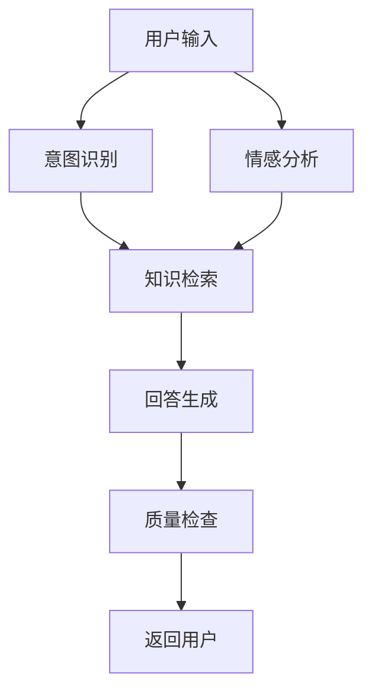
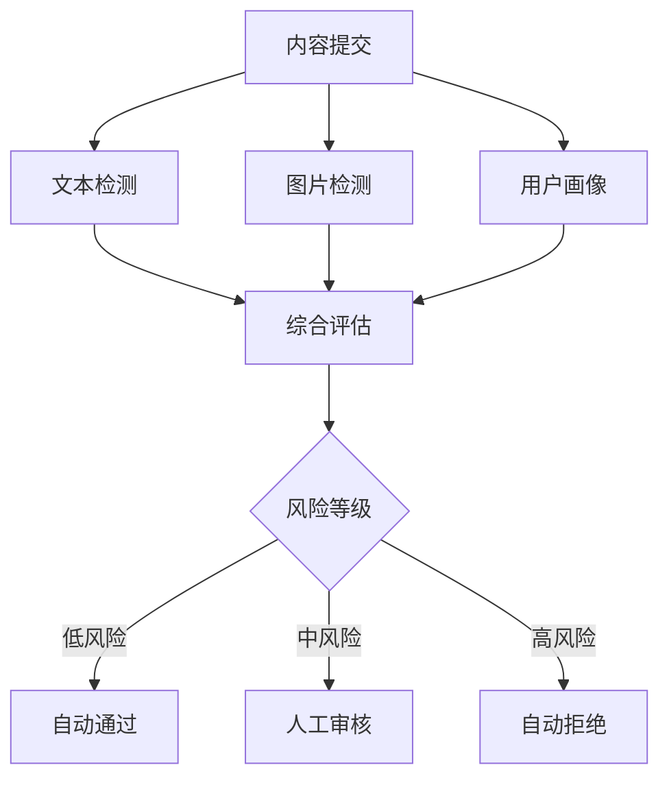
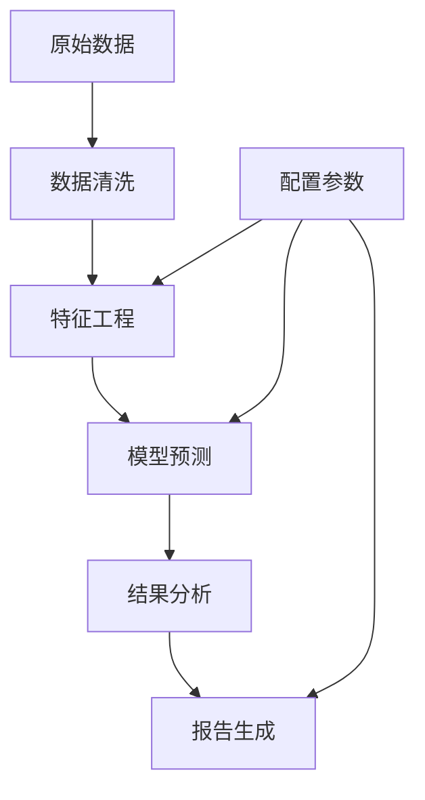

# Eino 工作流编排框架 - 从入门到精通

## 🎯 什么是工作流编排？

想象一下，你正在经营一家咖啡店。每当有顾客点单时，需要完成一系列步骤：
1. 接收订单信息
2. 检查库存
3. 制作咖啡
4. 打包
5. 交付给顾客

这就是一个工作流！在AI应用中也是如此，比如处理用户的文本消息：
1. 接收用户输入
2. 预处理文本
3. 分析情感
4. 生成回复
5. 返回结果

**Eino 工作流编排框架**就像是咖啡店的管理系统，帮你自动协调这些步骤，确保它们按正确的顺序执行，数据能正确传递。

## 🏗️ 为什么需要工作流编排？

### 传统方式的问题
```go
// 传统的代码方式 - 写死的流程
func processText(input string) string {
    preprocessed := preprocess(input)
    sentiment := analyzeSentiment(preprocessed) 
    keywords := extractKeywords(preprocessed)
    result := generateResponse(sentiment, keywords)
    return result
}
```

**问题：**
- 🔒 流程固定，难以修改
- 🔗 步骤紧耦合，一个出错全部停止
- 📊 无法并行处理，效率低
- 🔍 难以监控每个步骤的状态
- 🔄 无法动态调整处理逻辑

### 工作流编排的优势
```go
// 工作流编排方式 - 灵活可配置
workflow := NewWorkflow()
workflow.AddNode("preprocess", preprocessNode)
workflow.AddNode("sentiment", sentimentNode) 
workflow.AddNode("keywords", keywordsNode)
workflow.AddNode("response", responseNode)

// 灵活配置数据流
workflow.Connect("preprocess", "sentiment")
workflow.Connect("preprocess", "keywords")  // 可以并行
workflow.Connect("sentiment", "response")
workflow.Connect("keywords", "response")
```

**优势：**
- 🎛️ 灵活配置，随时调整
- ⚡ 自动并行，提高效率  
- 🛡️ 错误隔离，单点故障不影响全局
- 📈 详细监控，实时了解进度
- 🔄 动态扩展，轻松添加新功能

## 🧩 核心概念详解

### 1. 节点(Node) - 工作的基本单位

就像咖啡店里的每个工位一样，节点是执行具体工作的地方。

```go
// 一个简单的文本处理节点
func textProcessNode(input TextData) TextResult {
    // 实际的文本处理逻辑
    processed := strings.ToLower(strings.TrimSpace(input.Text))
    
    return TextResult{
        ProcessedText: processed,
        WordCount: len(strings.Fields(processed)),
    }
}
```

**节点的特点：**
- 🎯 **专一职责**：每个节点只做一件事，比如"文本预处理"、"情感分析"
- 📥 **标准输入**：接收规定格式的数据
- 📤 **标准输出**：返回规定格式的结果
- 🔄 **可复用**：同一个节点可以在不同的工作流中使用

### 2. 边(Edge) - 数据传递的通道

边就像咖啡店里的传菜窗口，负责把一个工位的成果传递给下一个工位。

```go
// 配置数据传递
workflow.AddInput("sentiment_node", map[string]string{
    "text": "preprocess_node.output.processed_text",  // 从预处理节点获取文本
    "language": "static.chinese",                  // 使用静态配置
})
```

**边的类型：**
- 📊 **数据边**：传递实际的数据，如处理后的文本
- 🎮 **控制边**：控制执行顺序，如"A完成后再执行B"  
- 🔧 **配置边**：传递配置参数，如模型温度、最大长度等

### 3. 字段映射 - 灵活的数据对接

这是Eino最强大的功能之一！就像万能转接头，可以把任何格式的数据转换成目标节点需要的格式。

```go
// 复杂的字段映射示例
workflow.AddInput("final_node", map[string]string{
    // 从多个节点组合数据
    "original_text": "input.user_message",                    // 原始输入
    "processed_text": "preprocess.output.clean_text",         // 预处理结果  
    "sentiment_score": "sentiment.output.score",               // 情感分数
    "keywords": "keywords.output.top_keywords",                // 关键词列表
    "user_id": "input.user_id",                               // 用户ID
    "timestamp": "preprocess.metadata.process_time",           // 处理时间
    
    // 使用静态配置
    "model_name": "static.gpt-4",                             // 模型名称
    "temperature": "static.0.7",                              // 温度参数
    
    // 甚至可以引用嵌套字段
    "user_preference": "user_profile.settings.language.preference",
})
```

## 🚀 实际应用场景

### 场景1：智能客服系统



```go
// 智能客服工作流配置
workflow := NewWorkflow()

// 添加各种处理节点
workflow.AddNode("intent", intentRecognitionNode)    // 意图识别
workflow.AddNode("sentiment", sentimentAnalysisNode) // 情感分析  
workflow.AddNode("search", knowledgeSearchNode)      // 知识检索
workflow.AddNode("generate", responseGenerateNode)   // 回答生成
workflow.AddNode("quality", qualityCheckNode)        // 质量检查

// 配置数据流 - 并行处理提高效率
workflow.Connect("input", "intent")      // 意图识别
workflow.Connect("input", "sentiment")   // 情感分析(并行)

// 知识检索需要意图和情感信息
workflow.AddInput("search", map[string]string{
    "query": "input.user_message",
    "intent": "intent.output.detected_intent", 
    "emotion": "sentiment.output.emotion_type",
})

// 生成回答需要所有前置信息
workflow.AddInput("generate", map[string]string{
    "original_query": "input.user_message",
    "knowledge": "search.output.relevant_docs",
    "user_emotion": "sentiment.output.emotion_type",
    "intent_type": "intent.output.detected_intent",
    "confidence": "intent.output.confidence_score",
})
```

### 场景2：内容审核系统



```go
// 内容审核工作流 - 支持分支决策
workflow := NewWorkflow()

workflow.AddNode("text_check", textModerationNode)
workflow.AddNode("image_check", imageModerationNode)  
workflow.AddNode("user_profile", userProfileNode)
workflow.AddNode("risk_assess", riskAssessmentNode)

// 分支决策节点
workflow.AddBranchNode("decision", func(input RiskResult) string {
    if input.RiskScore < 0.3 {
        return "auto_approve"    // 低风险自动通过
    } else if input.RiskScore < 0.7 {
        return "manual_review"   // 中风险人工审核  
    } else {
        return "auto_reject"     // 高风险自动拒绝
    }
})
```

### 场景3：数据分析流水线



```go
// 数据分析工作流 - 支持配置参数
workflow := NewWorkflow()

// 设置可调参数
workflow.SetConfig("feature_count", 100)
workflow.SetConfig("model_type", "random_forest")
workflow.SetConfig("report_format", "pdf")

workflow.AddNode("clean", dataCleaningNode)
workflow.AddNode("feature", featureEngineeringNode)
workflow.AddNode("predict", modelPredictionNode) 
workflow.AddNode("analyze", resultAnalysisNode)
workflow.AddNode("report", reportGenerationNode)

// 使用配置参数
workflow.AddInput("feature", map[string]string{
    "raw_data": "clean.output.cleaned_data",
    "feature_count": "config.feature_count",  // 使用配置
})

workflow.AddInput("predict", map[string]string{
    "features": "feature.output.feature_matrix",
    "model_type": "config.model_type",         // 使用配置
})
```

## 🛠️ 核心API详解

### 1. 创建工作流

```go
// 基础创建
workflow := NewWorkflow()

// 带类型约束的创建（推荐）
workflow := NewWorkflow[UserInput, ProcessResult]()
```

### 2. 添加节点

```go
// Lambda函数节点 - 最常用
workflow.AddLambdaNode("processor", func(ctx context.Context, input InputData) (OutputData, error) {
    // 你的处理逻辑
    return processData(input)
})

// 聊天模型节点 - AI对话
workflow.AddChatModelNode("chat", chatModel)

// 工具节点 - 外部服务调用
workflow.AddToolNode("search", searchTool)

// 条件分支节点 - 流程控制
workflow.AddBranchNode("decision", func(input Data) string {
    // 返回下一个要执行的路径
    return "path_a" // 或 "path_b"
})
```

### 3. 配置数据流

```go
// 简单连接 - A的输出直接给B
workflow.Connect("nodeA", "nodeB")

// 复杂映射 - 精确控制每个字段
workflow.AddInput("target_node", map[string]string{
    // 基本映射
    "user_input": "input.message",
    
    // 嵌套字段访问
    "processed_text": "preprocess.result.clean_text",
    
    // 静态值
    "api_key": "static.your_api_key",
    
    // 配置值  
    "temperature": "config.model_temperature",
    
    // 条件值(高级用法)
    "language": "user_profile.settings.language || static.english",
})
```

### 4. 执行工作流

```go
// 同步执行 - 等待完成
result, err := workflow.Invoke(ctx, input)
if err != nil {
    log.Fatal(err)
}
fmt.Printf("结果: %+v", result)

// 流式执行 - 边计算边获取结果
stream, err := workflow.Stream(ctx, input)
for chunk := range stream {
    fmt.Printf("进度: %+v", chunk)
}

// 异步执行 - 后台运行
future := workflow.InvokeAsync(ctx, input)
// 做其他事情...
result := future.Wait() // 等待完成
```

## 🎨 高级特性详解

### 1. 动态配置 - 运行时调整

```go
// 创建时设置默认配置
workflow.SetConfig("temperature", 0.7)
workflow.SetConfig("max_tokens", 1000)

// 运行时动态调整
runtimeConfig := map[string]interface{}{
    "temperature": 0.9,  // 提高创造性
    "max_tokens": 2000,  // 增加输出长度
}

result, err := workflow.InvokeWithConfig(ctx, input, runtimeConfig)
```

### 2. 条件分支 - 智能路由

```go
// 复杂的分支逻辑
workflow.AddBranchNode("smart_router", func(input ProcessData) string {
    // 基于内容类型路由
    if input.ContentType == "image" {
        return "image_process_path"
    }
    
    // 基于用户等级路由  
    if input.UserLevel == "premium" {
        return "premium_process_path" 
    }
    
    // 基于内容复杂度路由
    if input.ComplexityScore > 0.8 {
        return "complex_process_path"
    }
    
    return "standard_process_path"
})

// 为不同路径添加不同的处理节点
workflow.AddPath("image_process_path", imageProcessingNodes...)
workflow.AddPath("premium_process_path", premiumProcessingNodes...)
workflow.AddPath("complex_process_path", complexProcessingNodes...)
```

### 3. 错误处理 - 优雅降级

```go
// 节点级别的错误处理
workflow.AddLambdaNode("risky_process", func(ctx context.Context, input Data) (Result, error) {
    result, err := riskyOperation(input)
    if err != nil {
        // 返回降级结果而不是失败
        return getDegradedResult(input), nil
    }
    return result, nil
})

// 工作流级别的错误处理
workflow.OnError(func(nodeName string, err error, input interface{}) interface{} {
    log.Printf("节点 %s 出错: %v", nodeName, err)
    
    // 返回默认值继续执行
    return getDefaultValue(nodeName, input)
})

// 重试机制
workflow.SetRetryPolicy("unstable_node", RetryPolicy{
    MaxAttempts: 3,
    BackoffDelay: time.Second,
})
```

### 4. 监控和可观测性

```go
// 添加监控钩子
workflow.OnNodeStart(func(nodeName string, input interface{}) {
    fmt.Printf("🚀 开始执行节点: %s", nodeName)
    // 记录到监控系统
    metrics.IncrementCounter("node.start", nodeName)
})

workflow.OnNodeComplete(func(nodeName string, output interface{}, duration time.Duration) {
    fmt.Printf("✅ 节点完成: %s, 耗时: %v", nodeName, duration) 
    // 记录性能指标
    metrics.RecordLatency("node.duration", nodeName, duration)
})

workflow.OnNodeError(func(nodeName string, err error) {
    fmt.Printf("❌ 节点出错: %s, 错误: %v", nodeName, err)
    // 发送告警
    alert.SendError(nodeName, err)
})
```

## ⚡ 性能优化技巧

### 1. 并行执行最大化

```go
// 分析依赖关系，找出可以并行的节点
workflow := NewWorkflow()

// 这些节点可以并行执行
workflow.AddNode("sentiment", sentimentNode)   // 独立分析
workflow.AddNode("keywords", keywordNode)     // 独立提取  
workflow.AddNode("language", languageNode)    // 独立检测

// 它们都依赖预处理，但互相不依赖
workflow.Connect("preprocess", "sentiment")
workflow.Connect("preprocess", "keywords") 
workflow.Connect("preprocess", "language")

// 最后汇总时才需要等待所有结果
workflow.AddInput("summary", map[string]string{
    "sentiment": "sentiment.output",
    "keywords": "keywords.output", 
    "language": "language.output",
})
```

### 2. 资源池化

```go
// 创建资源池避免重复初始化
type ModelPool struct {
    models chan *ChatModel
}

func (p *ModelPool) GetModel() *ChatModel {
    return <-p.models  // 从池中获取
}

func (p *ModelPool) ReturnModel(model *ChatModel) {
    p.models <- model  // 归还到池中
}

// 在节点中使用资源池
workflow.AddLambdaNode("chat", func(ctx context.Context, input ChatInput) (ChatOutput, error) {
    model := modelPool.GetModel()
    defer modelPool.ReturnModel(model)
    
    return model.Chat(input.Message)
})
```

### 3. 缓存机制

```go
// 添加缓存层
type CachedNode struct {
    cache map[string]interface{}
    node  LambdaFunc
}

func (c *CachedNode) Process(input interface{}) (interface{}, error) {
    // 计算缓存键
    key := fmt.Sprintf("%x", sha256.Sum256([]byte(fmt.Sprintf("%+v", input))))
    
    // 检查缓存
    if result, exists := c.cache[key]; exists {
        return result, nil
    }
    
    // 执行计算
    result, err := c.node(input)
    if err == nil {
        c.cache[key] = result  // 缓存结果
    }
    
    return result, err
}
```

## 📊 与其他框架对比

### Eino Workflow vs LangChain

| 特性 | Eino Workflow | LangChain |
|------|---------------|-----------|
| 🎯 **设计目标** | 大模型应用编排 | 通用AI应用开发 |
| 🏗️ **架构** | 原生Go，高性能 | Python生态，丰富扩展 |
| 🔗 **字段映射** | 灵活的任意字段映射 | 相对固定的链式调用 |
| ⚡ **并行能力** | 原生并行支持 | 需要额外配置 |
| 🛠️ **类型安全** | Go强类型检查 | Python动态类型 |
| 📈 **性能** | 更高效的内存使用 | 更多的运行时开销 |
| 🎨 **易用性** | 专注核心功能 | 功能更全面 |

### Eino Workflow vs Apache Airflow

| 特性 | Eino Workflow | Apache Airflow |
|------|---------------|----------------|
| 🎯 **使用场景** | 实时AI应用 | 批处理数据管道 |
| ⚡ **延迟** | 毫秒级响应 | 分钟级调度 |
| 📊 **状态管理** | 内存状态 | 持久化状态 |
| 🔄 **动态性** | 运行时动态配置 | 静态DAG定义 |
| 🏗️ **部署** | 应用内嵌入 | 独立服务部署 |

## 🚀 最佳实践指南

### 1. 节点设计原则

```go
// ✅ 好的节点设计
func goodTextProcessor(ctx context.Context, input TextInput) (TextOutput, error) {
    // 1. 单一职责 - 只做文本预处理
    cleaned := strings.TrimSpace(input.Text)
    
    // 2. 无状态 - 不依赖外部状态
    wordCount := len(strings.Fields(cleaned))
    
    // 3. 幂等性 - 相同输入产生相同输出
    return TextOutput{
        CleanText: cleaned,
        WordCount: wordCount,
        ProcessedAt: time.Now(), // 时间戳可以例外
    }, nil
}

// ❌ 不好的节点设计
var globalCounter int // 全局状态 - 避免

func badProcessor(input interface{}) interface{} {
    globalCounter++  // 依赖全局状态 - 不好
    
    // 职责混乱 - 既处理文本又发邮件
    result := processText(input)
    sendEmail(result)
    updateDatabase(result)
    
    return result
}
```

### 2. 工作流组织

```go
// ✅ 清晰的工作流结构
func buildUserInteractionWorkflow() *Workflow {
    workflow := NewWorkflow()
    
    // 输入层 - 数据接收和验证
    workflow.AddNode("validate", validateInput)
    workflow.AddNode("preprocess", preprocessText)
    
    // 分析层 - 并行分析
    workflow.AddNode("intent", detectIntent)
    workflow.AddNode("sentiment", analyzeSentiment) 
    workflow.AddNode("entities", extractEntities)
    
    // 决策层 - 业务逻辑
    workflow.AddNode("decision", makeDecision)
    
    // 输出层 - 结果生成
    workflow.AddNode("response", generateResponse)
    workflow.AddNode("format", formatOutput)
    
    // 配置清晰的数据流
    setupDataFlow(workflow)
    
    return workflow
}
```

### 3. 错误处理策略

```go
// 分层错误处理
workflow.OnError(func(nodeName string, err error, input interface{}) interface{} {
    switch {
    case strings.Contains(nodeName, "external_"):
        // 外部服务错误 - 使用降级方案
        return getDegradedResponse(input)
        
    case strings.Contains(nodeName, "critical_"):
        // 核心业务错误 - 立即失败
        return nil // 让工作流失败
        
    default:
        // 普通错误 - 记录并继续
        log.Printf("节点错误: %s - %v", nodeName, err)
        return getDefaultValue(nodeName, input)
    }
})
```

### 4. 测试策略

```go
func TestWorkflow(t *testing.T) {
    // 1. 单元测试 - 测试单个节点
    t.Run("TestTextProcessor", func(t *testing.T) {
        input := TextInput{Text: "  Hello World!  "}
        output, err := textProcessorNode(context.Background(), input)
        
        assert.NoError(t, err)
        assert.Equal(t, "hello world!", output.CleanText)
        assert.Equal(t, 2, output.WordCount)
    })
    
    // 2. 集成测试 - 测试完整流程  
    t.Run("TestCompleteWorkflow", func(t *testing.T) {
        workflow := buildTestWorkflow()
        
        input := WorkflowInput{Message: "测试消息"}
        output, err := workflow.Invoke(context.Background(), input)
        
        assert.NoError(t, err)
        assert.NotEmpty(t, output.Response)
    })
    
    // 3. 性能测试 - 测试响应时间
    t.Run("TestPerformance", func(t *testing.T) {
        workflow := buildTestWorkflow()
        
        start := time.Now()
        _, err := workflow.Invoke(context.Background(), testInput)
        duration := time.Since(start)
        
        assert.NoError(t, err)
        assert.Less(t, duration, 100*time.Millisecond) // 要求100ms内完成
    })
}
```

## 🔮 进阶用法

### 1. 自定义节点类型

```go
// 创建自定义的数据库节点类型
type DatabaseNode struct {
    ConnectionString string
    Query            string
}

func (d *DatabaseNode) Execute(ctx context.Context, input interface{}) (interface{}, error) {
    db, err := sql.Open("mysql", d.ConnectionString)
    if err != nil {
        return nil, err
    }
    defer db.Close()
    
    // 执行查询
    rows, err := db.QueryContext(ctx, d.Query, input)
    if err != nil {
        return nil, err
    }
    defer rows.Close()
    
    // 处理结果...
    return processRows(rows)
}

// 在工作流中使用
workflow.AddCustomNode("user_query", &DatabaseNode{
    ConnectionString: "user:pass@tcp(localhost:3306)/dbname",
    Query: "SELECT * FROM users WHERE id = ?",
})
```

### 2. 动态工作流生成

```go
// 根据配置动态生成工作流
func CreateWorkflowFromConfig(config WorkflowConfig) *Workflow {
    workflow := NewWorkflow()
    
    // 动态添加节点
    for _, nodeConfig := range config.Nodes {
        switch nodeConfig.Type {
        case "text_process":
            workflow.AddNode(nodeConfig.Name, createTextProcessor(nodeConfig.Params))
        case "ai_chat": 
            workflow.AddNode(nodeConfig.Name, createChatNode(nodeConfig.Params))
        case "database":
            workflow.AddNode(nodeConfig.Name, createDatabaseNode(nodeConfig.Params))
        }
    }
    
    // 动态配置连接
    for _, connection := range config.Connections {
        workflow.Connect(connection.From, connection.To)
    }
    
    return workflow
}

// 使用配置文件
configData := `{
  "nodes": [
    {"name": "preprocess", "type": "text_process", "params": {"action": "clean"}},
    {"name": "analyze", "type": "ai_chat", "params": {"model": "gpt-4"}},
    {"name": "save", "type": "database", "params": {"table": "results"}}
  ],
  "connections": [
    {"from": "preprocess", "to": "analyze"},
    {"from": "analyze", "to": "save"}
  ]
}`

var config WorkflowConfig
json.Unmarshal([]byte(configData), &config)
workflow := CreateWorkflowFromConfig(config)
```

### 3. 流式处理高级用法

```go
// 流式聊天对话
func StreamingChatWorkflow() *Workflow {
    workflow := NewWorkflow()
    
    // 流式处理节点
    workflow.AddStreamNode("chat", func(ctx context.Context, input <-chan ChatChunk) <-chan ChatResponse {
        output := make(chan ChatResponse)
        
        go func() {
            defer close(output)
            
            for chunk := range input {
                // 实时处理每个数据块
                response := processChunk(chunk)
                
                // 立即返回结果，不等待完整处理完成
                select {
                case output <- response:
                case <-ctx.Done():
                    return
                }
            }
        }()
        
        return output
    })
    
    return workflow
}

// 使用流式工作流
stream, err := workflow.Stream(ctx, input)
for response := range stream {
    fmt.Printf("实时响应: %s\n", response.Content)
    // 可以立即展示给用户，不需要等待完整回复
}
```

## 📚 学习路径建议

### 🚀 入门阶段 (1-2周)
1. **理解基本概念**：节点、边、工作流
2. **运行示例代码**：跑通基础的文本处理工作流  
3. **手写简单工作流**：2-3个节点的线性流程
4. **掌握字段映射**：理解数据如何在节点间传递

### 🎯 进阶阶段 (2-4周) 
1. **并行处理**：设计可以并行执行的工作流
2. **分支控制**：实现条件分支和智能路由
3. **错误处理**：添加重试、降级、容错机制
4. **性能优化**：缓存、资源池、批处理

### 🏆 高级阶段 (1-2月)
1. **自定义节点**：开发专用的节点类型
2. **动态工作流**：运行时生成和修改工作流  
3. **监控集成**：添加详细的可观测性
4. **生产部署**：处理实际业务场景

### 📖 推荐学习资源
- **官方文档**：[CloudWeGo Eino文档](https://www.cloudwego.io/zh/docs/eino/)
- **示例代码**：本目录下的 `workflow_orchestration_demo.go`
- **社区讨论**：GitHub Issues 和 Discussions
- **相关技术**：学习 DAG(有向无环图) 的基本概念

## 🎉 总结

Eino 工作流编排框架就像是为AI应用量身定制的"乐高积木系统"：

- 🧩 **模块化**：每个节点都是独立的积木，可以自由组合
- 🔗 **连接灵活**：积木间的连接方式非常灵活，支持复杂的组合
- ⚡ **高性能**：原生Go实现，速度快，资源占用少
- 🎯 **专业化**：专门为大模型应用优化，功能精准

无论你是AI应用的新手还是专家，这个框架都能帮你：
- 新手：快速搭建复杂的AI应用，不需要处理底层细节
- 专家：精确控制每个处理步骤，实现复杂的业务逻辑

现在就开始你的工作流编排之旅吧！🚀

## 架构设计

### 框架定位
```
┌─────────────────────────────────────┐
│        Application Layer            │
├─────────────────────────────────────┤
│  Graph API    │  Workflow API       │  <- 同等架构层级
├─────────────────────────────────────┤
│         Core Components             │
│  Chain │ Tool │ ChatModel │ Lambda  │
├─────────────────────────────────────┤
│         Infrastructure              │
└─────────────────────────────────────┘
```

### 数据流设计
- **节点(Node)**：工作流的基本处理单元
- **边(Edge)**：定义节点间的数据流和控制流关系
- **映射器(Mapper)**：处理不同节点间的字段映射
- **执行器(Executor)**：负责工作流的执行调度

## 核心 API

### 1. 工作流创建
```go
// 创建工作流
workflow := NewWorkflow[InputType, OutputType]()
```

### 2. 节点管理
```go
// 添加 Lambda 节点
workflow.AddLambdaNode("node_name", lambda_func)

// 添加 ChatModel 节点  
workflow.AddChatModelNode("model_node", chat_model)

// 添加 Tool 节点
workflow.AddToolNode("tool_node", tool_instance)
```

### 3. 字段映射配置
```go
// 配置输入映射
workflow.AddInput("target_node", map[string]string{
    "field1": "source_node.output.field1",
    "field2": "static_value",
})

// 设置静态值
workflow.SetStaticValue("node_name.field", static_value)
```

### 4. 工作流执行
```go
// 编译工作流
compiled_workflow, err := workflow.Compile()

// 执行工作流
result, err := compiled_workflow.Invoke(ctx, input)

// 流式执行
stream, err := compiled_workflow.Transform(ctx, input)
```

## 使用场景

### 1. 大语言模型应用开发
- **多轮对话系统**：处理复杂的对话流程
- **RAG 系统**：检索增强生成的完整流程
- **智能Agent**：多工具协作的智能代理

### 2. 复杂业务流程编排
- **文档处理流水线**：从解析到分析的完整流程
- **数据分析工作流**：多步骤数据处理和分析
- **内容生成流程**：从规划到生成的内容创作流程

### 3. 微服务编排
- **服务协调**：多个微服务间的协调调用
- **异步处理**：支持异步任务的编排
- **错误处理**：统一的错误处理和恢复机制

## 高级特性

### 1. 分支控制
```go
// 条件分支示例
workflow.AddBranchNode("decision", func(input) string {
    if input.Score > 0.8 {
        return "high_quality_path"
    }
    return "normal_path"
})
```

### 2. 流式处理
```go
// 流式数据处理
stream, err := workflow.Transform(ctx, input)
for chunk := range stream {
    // 处理流式数据
    processChunk(chunk)
}
```

### 3. 动态配置
```go
// 运行时动态配置
workflow.SetRuntimeConfig("model.temperature", 0.7)
workflow.SetRuntimeConfig("retriever.top_k", 10)
```

## 最佳实践

### 1. 节点设计原则
- **单一职责**：每个节点专注于单一功能
- **无状态设计**：节点应该是无状态的，便于并行执行
- **错误边界**：合理设置错误处理边界

### 2. 性能优化
- **并行执行**：充分利用节点间的并行执行机会
- **资源复用**：合理复用昂贵的资源如模型实例
- **流式处理**：对于大数据量场景使用流式处理

### 3. 可维护性
- **清晰命名**：使用有意义的节点和字段名称
- **文档注释**：为复杂的工作流添加注释
- **模块化设计**：将复杂工作流拆分为可重用的模块

## 与其他组件的关系

### Graph vs Workflow
- **Graph**：适合静态的、结构化的处理流程
- **Workflow**：适合动态的、复杂的业务流程编排

### Chain vs Workflow  
- **Chain**：适合简单的线性处理流程
- **Workflow**：适合复杂的非线性、多分支流程

### 组合使用
可以在 Workflow 的节点中使用 Chain 或 Graph 组件，实现更灵活的组合。

## 实际应用案例

### 1. 智能客服系统
```
输入问题 → 意图识别 → 知识检索 → 答案生成 → 质量评估 → 输出回答
         ↓           ↓         ↓         ↓
      情感分析 → 个性化配置 → 多轮对话 → 满意度预测
```

### 2. 内容审核系统  
```
内容输入 → 预处理 → 文本检测 → 图片检测 → 综合评估 → 审核结果
         ↓        ↓        ↓        ↓
      格式转换 → 敏感词过滤 → AI识别 → 人工复审
```

### 3. 文档智能处理
```
文档上传 → 格式识别 → 内容提取 → 结构化处理 → 知识抽取 → 入库存储
         ↓         ↓         ↓           ↓
      OCR处理 → 内容清洗 → 实体识别 → 关系抽取
```

## 总结

Eino Workflow 编排框架通过其灵活的字段映射、控制流与数据流分离、以及丰富的高级特性，为大模型应用开发提供了强大的工作流编排能力。它不仅简化了复杂业务流程的实现，还为开发者提供了高度可定制和可扩展的解决方案。

在实际应用中，Workflow 框架特别适合需要复杂决策逻辑、多步骤处理、以及动态流程控制的场景，是构建高质量AI应用的重要工具。